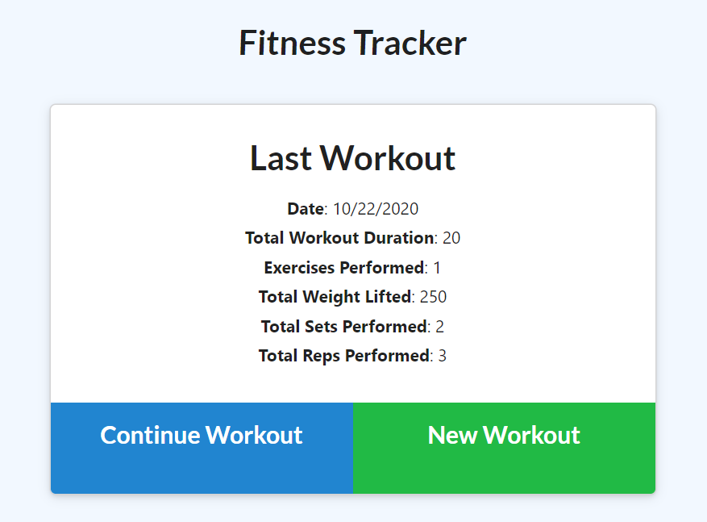
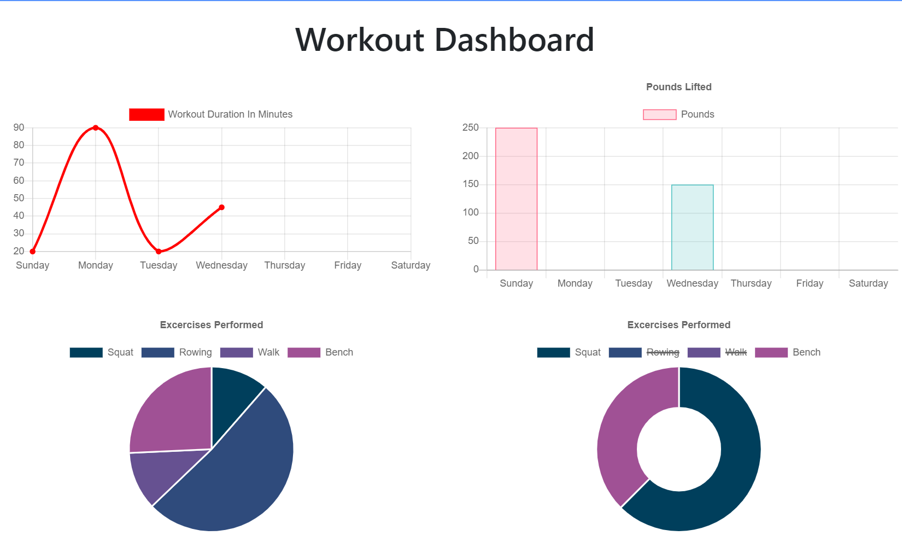

# Workout Tracker

## Table of Contents

* [General Info](#general-info)
* [Technologies](#technologies)
* [Features](#features)
* [How to Use](#how-to-use)
* [Application Demo](#application-demo)
* [Application Link](#application-link)
* [License](#license)
* [Contact](#contact)

## General Info

An application that allows users to view, create, and track daily workouts. Users are able to log multiple exercises in a workout on a given day. Users can also track the name, type, weight, sets, reps, and duration of exercises. If the exercise is a cardio exercise, users are also able to track the distance they have traveled.

## Technologies

* HTML
* JavaScript
* MongoDB
* Mongoose
* Express

## Features

## How to Use

To run this application locally:

* Clone or download the repository
* Open the code in your preferred code editor
* Open the integrated terminal in the code editor
* Run npm install in the terminal
* Enter nodemon server.js in the terminal

After following these steps, open your preferred browser and navigate to http://localhost:3030/

## Application Demo

## Application Link

[Workout Tracker](https://workout-tracker-kasey.herokuapp.com/)

## License

## Contact

* Email: jones.m.kasey@gmail.com

* GitHub: https://github.com/joneskm72